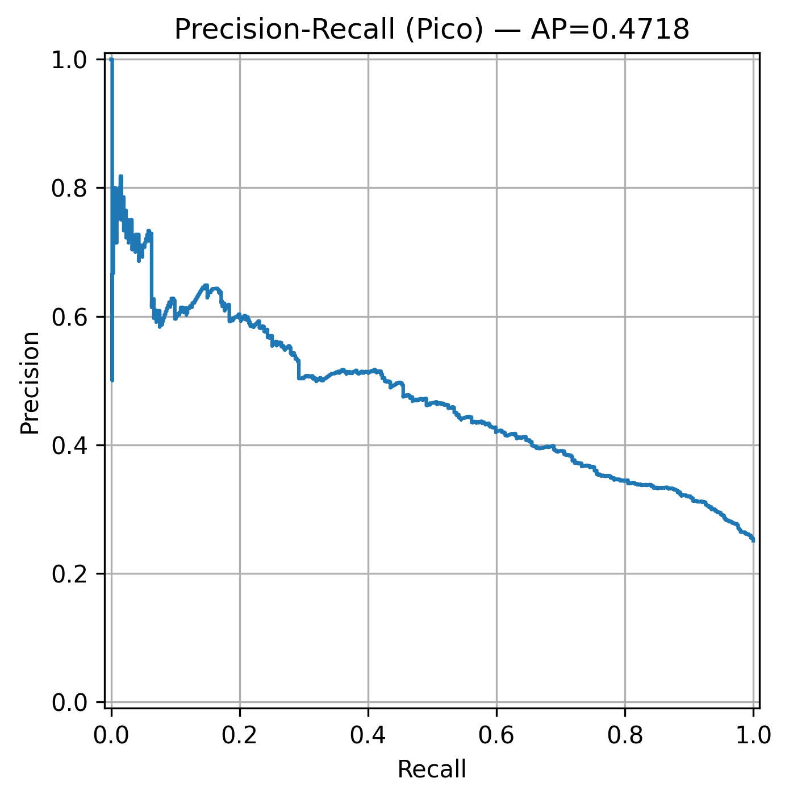
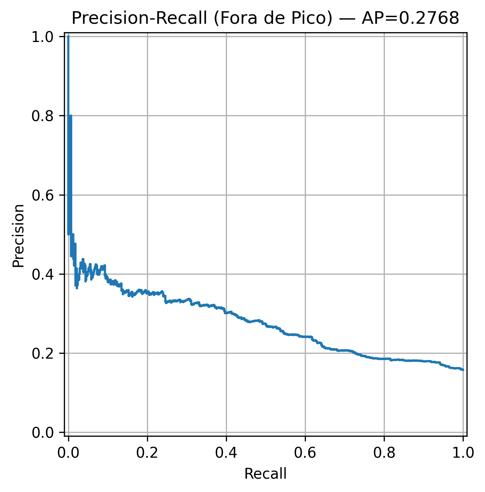
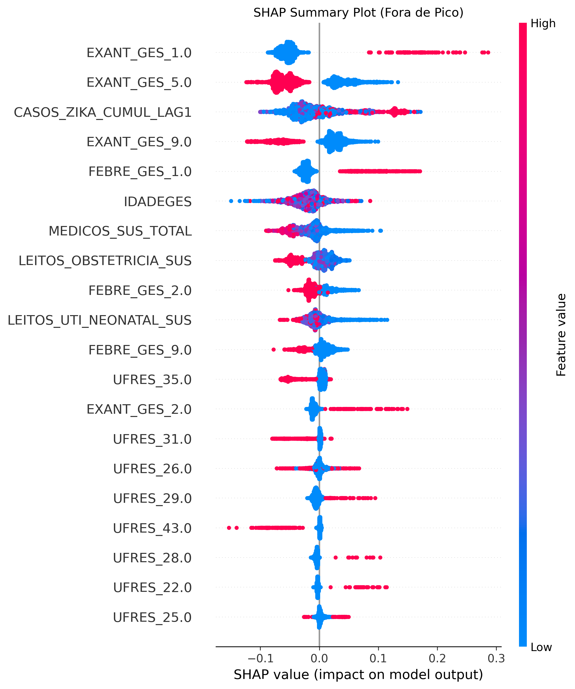

# 🦟 Análise Preditiva e Generalização Temporal de Microcefalia no Brasil

<div align="center">
</div>

<div align="center">


[](https://zenodo.org/records/17880753)

</div>

## Sumário

1. [Introdução](#-introdução)
2. [Objetivos](#-objetivos)
3. [Metodologia e Pipeline](#-metodologia-e-pipeline)
4. [Resultados e Discussão](#-resultados-e-discussão)
5. [Estudo de Ablação](#-estudo-de-ablação)
6. [Reproduzindo o Projeto](#-reproduzindo-o-projeto)
7. [Autores](#-autores)

---

## Introdução

Este projeto apresenta um modelo de **Machine Learning (Random Forest)** desenvolvido para classificar casos suspeitos de microcefalia no Brasil, utilizando dados do **Registro de Eventos em Saúde Pública (RESP)**. O foco central do trabalho não é apenas a classificação estática, mas a investigação da robustez temporal do modelo frente ao declínio da epidemia de Zika Vírus.

A análise abrange o período de **Pico Epidêmico (2015–2017)** e o período subsequente **Fora de Pico (2018–2024)**, diagnosticando o fenômeno de *Concept Drift* (mudança de conceito) e como variáveis de infraestrutura de saúde (CNES) influenciam o viés do modelo.

## Objetivos

1.  **Classificação:** Desenvolver um classificador capaz de distinguir casos "Confirmados" de "Descartados" maximizando o *Recall* (Sensibilidade).
2.  **Robustez Temporal:** Avaliar a degradação de performance do modelo quando aplicado em anos futuros (*Drift*).
3.  **Explicabilidade:** Utilizar SHAP e Permutation Importance para entender a mudança nos padrões de decisão do modelo.
4.  **Engenharia de Dados:** Integrar múltiplas fontes governamentais (RESP, SINAN, CNES) com rigor metodológico para evitar vazamento de dados (*Data Leakage*).

---

## Metodologia e Pipeline

O projeto implementa um pipeline **"Leak-Proof"** (à prova de vazamento), onde todas as transformações estatísticas são ajustadas exclusivamente nos dados de treino.

### Fontes de Dados
* **RESP (Microcefalia):** Dados clínicos e demográficos.
* **SINAN (Zika):** Incidência cumulativa de Zika (com *lag* temporal).
* **CNES (Infraestrutura):** Quantidade de médicos e leitos por UF (com *lag* de 1 ano).

### Estratégia de Modelagem
* **Algoritmo:** Random Forest Classifier.
* **Validação:** Divisão Cronológica (Corte em 31/12/2017) e Validação Cruzada (*TimeSeriesSplit*).
* **Tratamento de Desbalanceamento:** Utilização de `class_weight='balanced'`, que se mostrou superior ao SMOTE e Threshold Tuning.
* **Imputação:** Mediana (ajustada no treino) para mitigar a ausência de dados do CNES em 2015.

---

## Resultados e Discussão

Os experimentos demonstraram que o modelo aprende padrões robustos durante a epidemia, mas sofre degradação significativa no período posterior.

### 1. Comparação de Técnicas (Período de Pico)

| Técnica | Precision | Recall (Classe 1) | F1-Score | Observação |
| :--- | :---: | :---: | :---: | :--- |
| **Class Weight (Balanced)** | 0.40 | **0.68** | 0.50 | **Melhor Equilíbrio (Escolhido)** |
| SMOTE | 0.42 | 0.57 | 0.48 | Pior desempenho de Recall |
| Threshold Tuning | 0.25 | 1.00 | 0.40 | *Overfitting* (Classifica tudo como positivo) |
| *Baseline (Decision Tree)* | *0.39* | *0.51* | *0.44* | Modelo de referência |

> **Nota:** A precisão de 40% é aceita como *trade-off* para uma ferramenta de triagem epidemiológica, priorizando a não-omissão de casos graves (Recall alto).

### 2. Análise de Generalização (Concept Drift)

Ao aplicar o modelo treinado (2015-2017) nos dados futuros (2018-2024), observou-se uma queda drástica na sensibilidade:

* **Recall no Pico:** 68.0%
* **Recall Fora de Pico:** **43.0%** (Queda de 25 p.p.)

**Diagnóstico:** A análise de explicabilidade revelou que, no período pós-epidêmico, o modelo perde a referência do sinal biológico (Zika) e passa a depender excessivamente de **variáveis de infraestrutura** (ex: Quantidade de Médicos) como *proxy* para confirmação, gerando viés.

**Nota:** Ao reproduzir os experimentos utilizando o dataset anonimizado (que utiliza ordenação por Semana Epidemiológica em vez de Data Exata para proteger a privacidade), pode haver pequenas variações nas métricas (+/- 2%), sem alteração nas conclusões sobre o Concept Drift.

---

## Estudo de Ablação

Para provar a importância das fontes de dados externas, realizamos um estudo de ablação (retirada progressiva de features).

| Modelo (Features) | Recall (Pico) | Recall (Drift) | Conclusão |
| :--- | :---: | :---: | :--- |
| Apenas Clínico | 0.58 | 0.36 | Performance base limitada. |
| Clínico + Zika | 0.64 | **0.45** | Zika é crucial no pico. |
| **Completo (+ Infra)** | **0.68** | 0.43 | **Infraestrutura maximiza o pico, mas insere ruído no futuro.** |

---


### Visualização do Drift
Abaixo, comparamos a curva Precision-Recall entre o período de epidemia e o período posterior, evidenciando a perda de capacidade preditiva.

<div align="center">
  
  
</div>

### Diagnóstico de Viés (SHAP)
O gráfico SHAP demonstra como o modelo passa a ignorar sintomas clínicos no período pós-epidêmico.

<div align="center">
  
</div>

## Reproduzindo o Projeto

Para facilitar a reprodução e respeitar a LGPD (Lei Geral de Proteção de Dados), o repositório está configurado para rodar com **dados anonimizados** disponíveis no Zenodo.

### Pré-requisitos
* Python 3.9+
* Ambiente Linux/Windows/Mac

### Passo a Passo

1.  **Clone o repositório:**
    ```bash
    git clone https://github.com/deivyrossi/microcephaly_prediction_analysis.git
    cd microcephaly_prediction_analysis
    ```

2.  **Instale as dependências:**
    ```bash
    python3 -m venv venv
    source venv/bin/activate
    pip install -r requirements.txt
    ```

3.  **Baixe os Dados:**
    * Acesse o [Zenodo (Link Aqui)](https://zenodo.org/records/17880753).
    * Baixe `DATASET_PICO_ANONIMIZADO.csv` e `DATASET_FORA_PICO_ANONIMIZADO.csv`.
    * Coloque-os na pasta `dados/processados/`.
    * **Renomeie** para: `DADOS_PICO_EPIDEMICO.csv` e `DADOS_FORA_PICO.csv`.

4.  **Execute o Pipeline Completo:**
    ```bash
    python run_pipeline.py
    ```
    *Este comando irá treinar o modelo, gerar as métricas, os gráficos SHAP e as tabelas de resultados automaticamente na pasta `resultados/`.*

---

## Organização dos Arquivos

```text
.
├── run_pipeline.py          # Script mestre de execução
├── src/
│   ├── etl/                 
│   │   ├── process_resp.py  # Limpeza dos microdados do RESP
│   │   ├── process_sinan.py # Engenharia de features de lag do Zika
│   │   └── create_public_dataset.py # Script de anonimização (LGPD)
│   ├── eda/     
│   ├── train.py             # Treinamento do Random Forest
│   ├── analysis.py          # Geração de Gráficos e Métricas
│   ├── sensitivity.py       # Bootstrap para Intervalos de Confiança
│   └── utils.py             # Funções utilitárias
├── dados/                   # Local para armazenar os CSVs
└── resultados/           # Saída do modelo (Ignorado pelo Git)

```


## Como Citar

Se você utilizar este dataset ou código em sua pesquisa, por favor cite:

```bibtex
@misc{melo2025microcephaly,
  author       = {Melo, Deivy R. T.},
  title        = {Análise Preditiva e Generalização Temporal de Modelos de Ensemble para Classificação de Casos de Microcefalia no Brasil},
  year         = {2025},
  publisher    = {Zenodo},
  doi          = {10.5281/zenodo.17880753},
  url          = {[https://doi.org/10.5281/zenodo.17880753](https://doi.org/10.5281/zenodo.17880753)}
}

```
